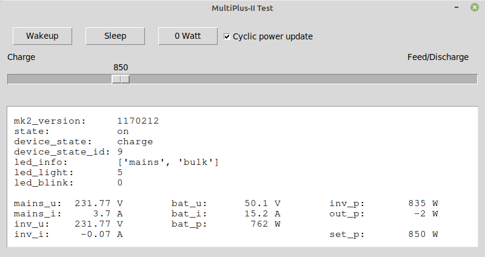

# Direct control of a Victron Multiplus II

The script allows the direct control of the charging and feeding power in the 
grid parallel operation. The Multiplus 2 is connected to a MK3 Inteface and controlled with 
ESS Mode 3. **No GX device or Venus device is needed.** The python script has no dependencies.

    update()   # get the Multiplus-II status
    command()  # set >0 for charging and <0 for feeding power in watt
    wakeup() 
    sleep()

# Simple demo application 

`demo_multiplus2.py`

    mp2.update()    # read all information
    print(mp2.data)  
    time.sleep(0.5)
    mp2.command(500)  # set charge power to 500Watt
    time.sleep(0.5)

# Demo Applikation in tkinter

Screenshot of `demo_multiplus2_gui.py` 

